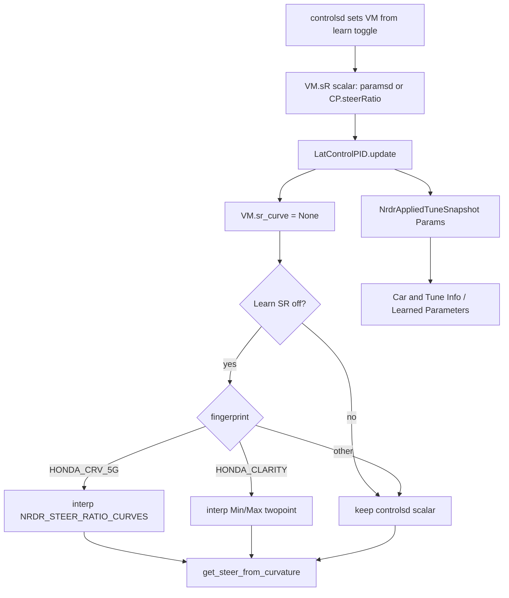
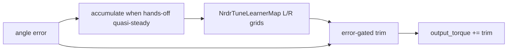
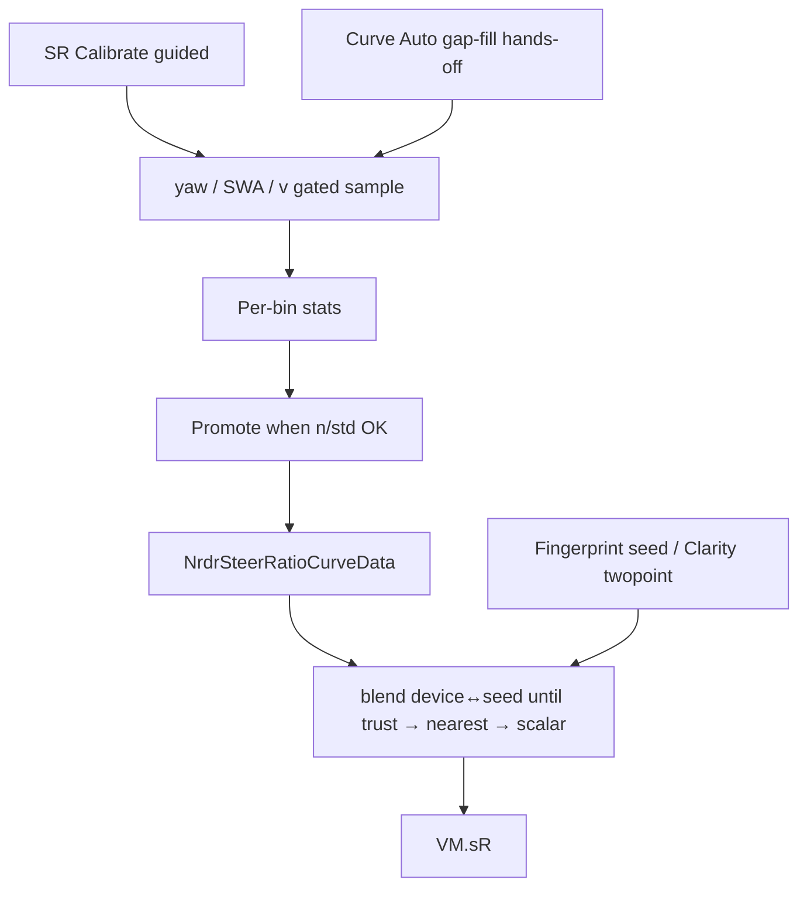
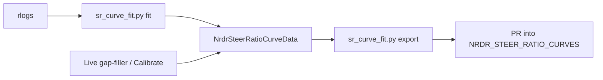

# nrdr openpilot — Architecture & Flow Maps

Paired with `AGENT_LOG.md`. Update matching maps when flows change.

---

## 1. Lateral steer-ratio apply path (today + Phase A)



**Key files:** `selfdrive/controls/controlsd.py`, `sunnypilot/selfdrive/controls/controlsd_ext.py`, `selfdrive/controls/lib/latcontrol_pid.py`, `opendbc_repo/opendbc/car/vehicle_model.py`.

---

## 2. NRDR settings tree

```text
NRDR
├── Learned Parameters     # scalar Auto toggles + applied SR readout (Phase A)
├── Lateral Tuning
│   ├── Car & Tune Info    # VIEW: static CP + currently applied stack
│   ├── PID/F Tuning Ground  # Min/Max (Clarity), banded scales, 2D Auto-Tuner
│   ├── Unwind / Override / Filters / Ford
├── Longitudinal Tuning
└── Special
```

---

## 3. TuneLearner (2D Auto-Tuner)



Only runs on **EPS-modified** Hondas inside `LatControlPID`. UI knobs: Enable / Strength / Rate / Reset. Phase A surfaces **applied trim** + map cell in VIEW.

**Key file:** `selfdrive/controls/lib/nrdr_tune_learner.py`.

---

## 4. Gap-filler (Phase B)



**Key file:** `selfdrive/controls/lib/nrdr_steer_ratio_curve.py` (wired from `latcontrol_pid.py`).

**SR Calibrate:** guided step-through — UI names next incomplete `|SWA|` bin target (“Hold ~100° L/R”), live in-band / hold-still / speed feedback, advance on `N_min`; complete = lock coverage then normal hands-off gap-fill.

**Calibrate driving protocol (author):** hold constant SWA for 2–3 laps per radius → adjust → repeat wide/medium/tight/near-lock; ≥7 mph (~10 mph wide); both CW and CCW. Gates: discard moving-wheel frames (`|steeringRate|` high) and slow frames. Bins still `|SWA|`; both directions recommended for bias/stats.

**Stickiness:** bin stats accumulate forever (until Reset). Promote only on sample milestones with step-clamp. Apply blends device with fingerprint seed until `promoted_n ≥ 5×N_min`.

**UI:** Learned Parameters — Curve Auto / Rate / Calibrate / Reset + **Fit from Logs SCAN/VIEW** + live guide line.

---

## 5. Seed graduation (Phase C)



**CLI:** `sr_curve_fit.py` — `view` / `fit [--apply] [--replace] [--calibrate] [--force]` / `export [--fingerprint]`. Same gates as live learner; yaw from **calibrated** pose. `--apply` **merges** into existing pool by default; `--replace` wipes. Refuses empty apply without `--force`. Human-reviewed paste into `NRDR_STEER_RATIO_CURVES`.

**Read-only diagnostic:** `steerratio_by_angle.py` (aligned ≥7 mph + rate gate; points at fit tool for writes).
