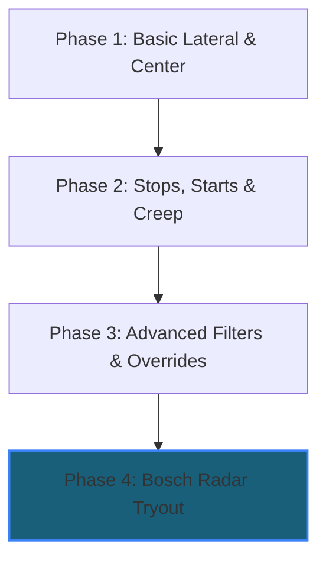

# NRDR Tuning Runbook — `radar-experimental`

Welcome to the `radar-experimental` branch. This guide is a step-by-step reference to help you dial in the custom lateral, override, and longitudinal (gas/brake) parameters before fully engaging the experimental Bosch radar.

> [!IMPORTANT]
> **First Boot SCons Build**: This branch intentionally forces a full compilation on its first boot to bake your new parameter keys into `params_pyx.so`. **The first boot will take 15–40 minutes.** Do NOT unplug or power-cycle the device during this build. Once booted, the `QuickBootToggle` will recreate the `prebuilt` marker, and all subsequent boots will be instant.

---

## 🛠️ Phase-by-Phase Tuning Workflow

We recommend tuning the car in phases. Dial in the physical steering and stopping behavior first, then enable advanced filters, and finally engage the radar tryout.

---

### 📍 Phase 1: Basic Lateral & Centering (On-Road)

Start with a baseline and dial in how the steering handles straight roads and curves.

1. **`LatPidTuneScale` (Default: `100%`)**
   - **What it does**: Scales overall lateral PID response.
   - **Tuning direction**: 
     - If the car feels twitchy, over-corrects, or "cuts" into corners too aggressively, reduce this to **`85% - 95%`**.
     - If the car wanders or feels too lazy on curves, increase this in steps of 5% up to **`110%`**.
2. **`HondaCenterScale` (Default: `0.5`)**
   - **What it does**: Controls extra steering stiffness specifically while driving straight at high speeds.
   - **Tuning direction**: If the car drifts on straight highways but handles curves perfectly, raise this towards **`0.7`** to lock in the center.

> [!NOTE]
> **Lateral defaults to PID-tune-only.** The live lateral learners
> (`NrdrLearnSteerRatio`, `NrdrLearnStiffness`, `NrdrLearnAngleOffset`) and the
> torque low-pass filter (`HondaTorqueLowPassFilter`) now default **OFF**, so the
> PID tune (`LatPidTuneScale` / `HondaPidTuneScale`) is the only thing shaping
> lateral control out of the box. Enable the learners/LPF manually once the base
> tune feels dialed in.

---

### 📍 Phase 2: Stops, Starts, and Creep (The Longitudinal Core)

This phase controls how smooth the transition is when coming to a complete stop and pulling away.

1. **`HondaStoppingDecelRate` (Default: `30`)**
   - **What it does**: The physical brake-rate limiter used by the carcontroller during a stop.
   - **Tuning direction**: If the final moment of stopping feels like a sudden "jerk" or grab of the brakes, lower this to **`20 - 25`** for a soft, gradual stop.
2. **`HondaStoppingDecelRateLong` (Default: `0.3`)**
   - **What it does**: The planner-side deceleration ramp-down rate.
   - **Tuning direction**: Increase to **`0.4 - 0.5`** if the car takes too long to slow down at the very end of a stop.
3. **`HondaStopAccel` (Default: `-2.0` m/s²)**
   - **What it does**: Holds the physical brakes down once fully stopped.
   - **Tuning direction**: If the car creeps forward on steep hills, lower this to **`-2.5`** to press the brake pedal firmer.
4. **`HondaVEgoStopping` & `HondaVEgoStarting` (Default: `0.5` m/s)**
   - **What they do**: The speeds below which the planner treats the car as stopping, and above which it treats it as starting.
   - **Tuning direction**: If the car pre-releases the brakes too early or hesitates to start crawling, adjust these thresholds in `0.1` increments.

---

### 📍 Phase 3: Advanced Filters, Unwinding & Driver Override

These settings eliminate steering wheel vibrations, optimize steering wheel return-to-center behavior, and make overriding openpilot feel completely natural.

1. **`HondaNotchEnabled` (Default: `OFF`)**
   - **What it does**: Activates a notch filter at **`7.5 Hz`** (Q factor **`1.5`**) to isolate and eliminate high-frequency resonance and vibration in the steering rack on highway curves.
2. **`HondaSteerDeltaLimiter` (Default: `OFF`)**
   - **What it does**: Smooths out sudden steer commands. Keeps steering fluid and comfortable.
3. **`HondaUnwindFreeze` (Default: `OFF`)**
   - **What it does**: Freezes the lateral PID integrator while the steering is returning toward center, preventing it from holding extra counter-torque through the unwind.
4. **`HondaUnwindLookahead` (Default: `OFF`)**
   - **What it does**: Reads the model's planned path to start unwinding earlier, before the instantaneous desired curvature drops.
5. **`NrdrIncreaseOverrideTolerance` (Default: `ON`)**
   - **What it does**: Prevents sudden dropped-torque alerts when you nudge the steering wheel. Makes steering hand-offs feel completely transparent.

---

### 📍 Phase 4: Engaging the Bosch Radar Tryout

Once your lateral control, stopping, and overrides are perfectly dialed, activate the radar:

* **`HondaCivicRadarTryout` (Default: `ON`)**
   - **What it does**: Commands openpilot to read fine-range radar object states (`0x280`) directly from the Bosch radar bus, fusing them into the longitudinal lead-estimation Kalman Filter.
   - **Expected behavior**: Eliminates camera-only "ghost leads" and improves stop-and-go reaction speed when trailing a vehicle.

---

## 📋 Full Parameter Reference

| Parameter Key | Default Value | Recommended Range | Description |
| :--- | :--- | :--- | :--- |
| **`LatPidTuneScale`** | `100%` | `80% - 120%` | Overall lateral feedback scale |
| **`HondaCenterScale`** | `0.5` | `0.1 - 1.0` | Centering force scaling on straightaways |
| **`HondaStoppingDecelRate`** | `30` | `15 - 50` | Physical brake rate clamp at the stop |
| **`HondaStoppingDecelRateLong`**| `0.3` | `0.1 - 1.0` | Planner deceleration ramp-down rate |
| **`HondaStopAccel`** | `-2.0` | `-3.5 - -1.0` | Static hold acceleration target (brake pressure) |
| **`HondaNotchEnabled`** | `OFF` | `ON / OFF` | 7.5 Hz notch filter for rack vibration |
| **`HondaSteerDeltaLimiter`** | `OFF` | `ON / OFF` | Jerk-reduction limiter for steering inputs |
| **`HondaUnwindFreeze`** | `OFF` | `ON / OFF` | Freezes PID integrator on steer unwind |
| **`HondaUnwindLookahead`** | `OFF` | `ON / OFF` | Looks ahead in model path to start unwind early |
| **`HondaLiveLearningGas`** | `ON` | `ON / OFF` | Adapts gas/wind compensation factors live |
| **`HondaCivicRadarTryout`** | `ON` | `ON / OFF` | Fuses Bosch fine-range radar track data |
